# E-Commerce Sales & Customer Analytics Using SQL

A comprehensive, portfolio-quality database analytics project designed for **MySQL 8.x** (Primary Execution in MySQL Workbench) and **PostgreSQL** (Secondary Dialect). It profiles customer demographics, transaction velocity, monthly trends, and basket co-occurrence across **2,000 transactions and 4,967 line items** to solve **52 business questions**.

---

## 📄 Project Overview
This project represents the rigorous work of a Data Analyst. Rather than simply executing generic queries, it establishes a formal metrics register, handles granularity join-multiplication risks, profiles anomalies via data quality checks, and deploys reusable views. It also features a Python validation harness that cross-reconciles multiple relational grains (line items, order headers, and customer totals) to guarantee absolute mathematical precision.

---

## 📊 Executive BI Interactive Analytics Dashboard

The project includes a production-grade, interactive web analytics dashboard built directly on top of the SQLite database engine, database views, and recognized revenue business definitions.

### 🌟 Dashboard Architecture & Tech Stack
- **Backend API**: Node.js & Express (`dashboard/server.js`) exposing RESTful SQL endpoints over SQLite database connection.
- **Frontend Engine**: Modular Vanilla JavaScript (`dashboard/public/app.js`), semantic HTML5, and custom responsive CSS system (`dashboard/public/style.css`).
- **Data Visualizations**: Integrated offline `Chart.js` charts (Revenue Trends, Running Total Revenue, Category Donut & Bar Charts, Geographic Revenue Heatmap, RFM Segment Distribution, Cohort Retention Curves).
- **Features**: Global multi-parameter filter pane (Date Range, City, Customer, Gender, Category, Product, Order Status), real-time KPI card computations, dynamic table sorting/pagination, active filter chips, CSV export, and database fallback connection safety.

### 🚀 How to Launch the Dashboard
```bash
# Navigate to the dashboard directory
cd dashboard

# Install dependencies (Express, SQLite3)
npm install

# Start the live analytics server
npm start
```
Open **[http://localhost:3000](http://localhost:3000)** in your web browser.

---

### 🖼️ Dashboard Preview & Interface Gallery

#### 1. Overview & Sales Performance
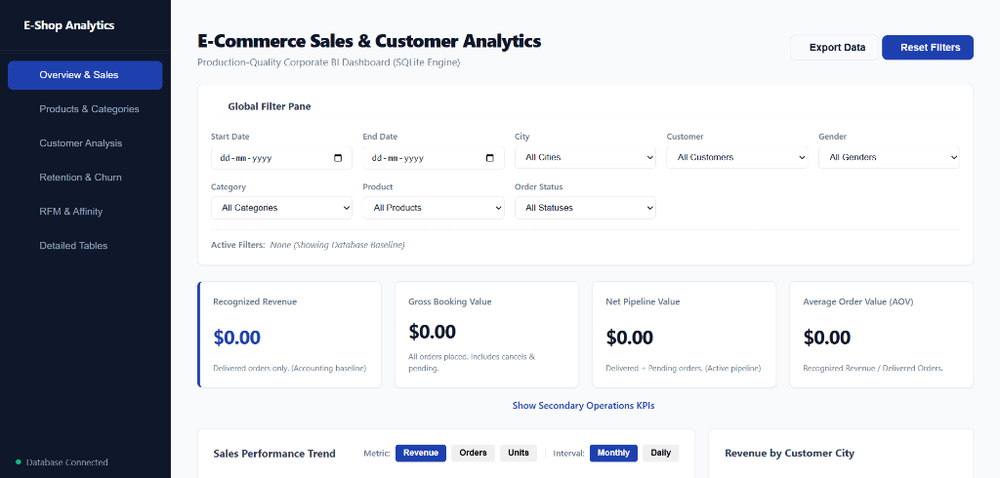
*Global Filter Pane with real-time multi-dimensional filter selection.*

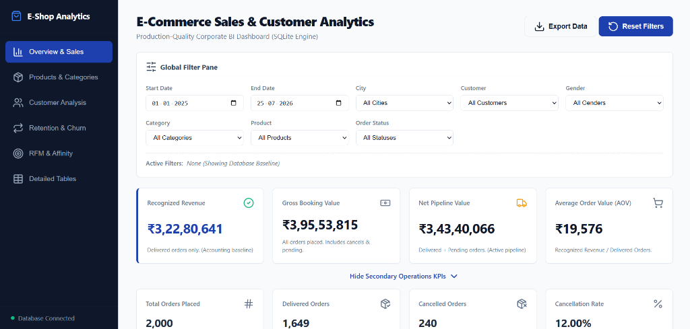
*Executive Revenue Metrics (Recognized Revenue ₹3.23Cr, Gross Booking Value ₹3.96Cr, Net Pipeline Value ₹3.43Cr, AOV ₹19,576).*

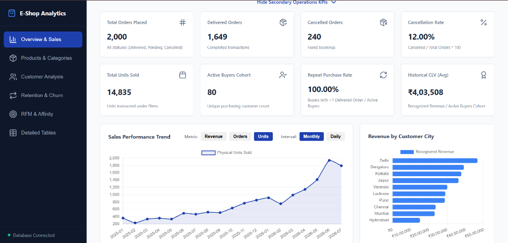
*Operations KPIs (2,000 Orders, 1,649 Delivered, 12% Cancellation Rate, 100% Repeat Purchase Rate) with Monthly Revenue Trend and Regional City Breakdown.*

#### 2. Products & Category Analytics
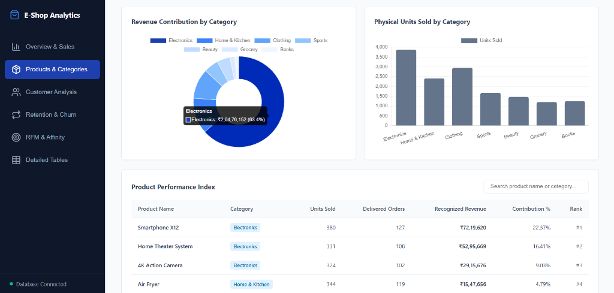
*Category Revenue Contribution (Electronics 63.4%) & Physical Unit Distribution with Product Performance Index Table.*

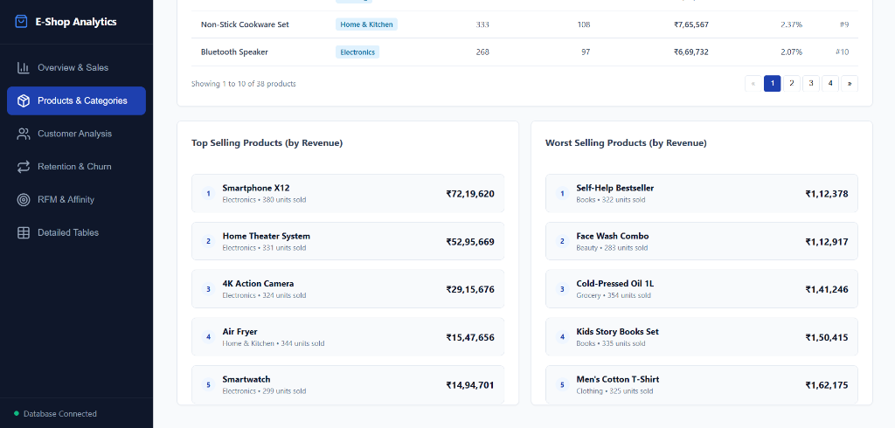
*Top Revenue Generators (Smartphone X12, Home Theater) vs Lowest Performing Catalog Items.*

#### 3. Customer Demographics & Behavior
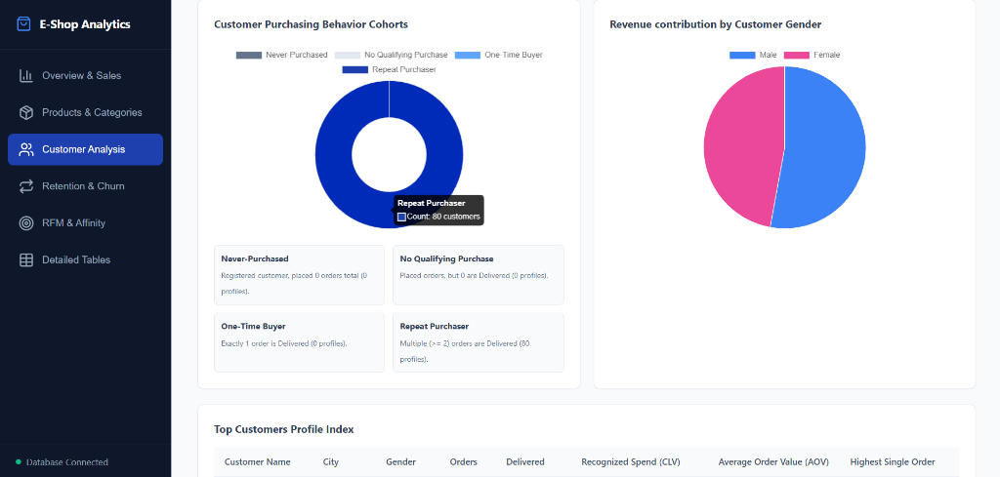
*Customer Purchasing Behavior Cohorts (80 Repeat Purchasers) & Gender Revenue Share.*

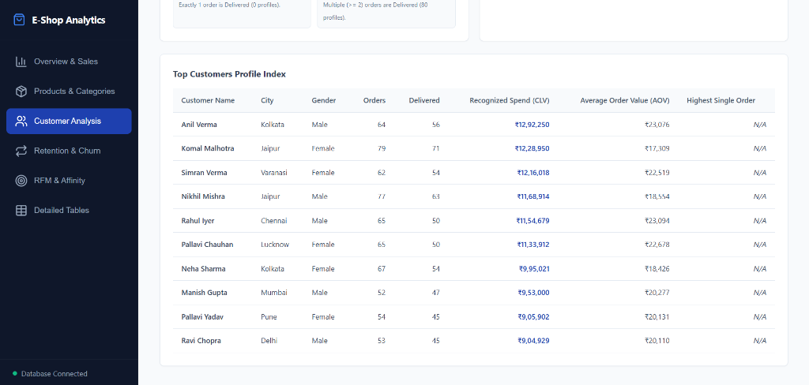
*Top Customer Profile Index detailing Orders, Delivered Count, Recognized CLV, and AOV.*

#### 4. Retention & Acquisition Dynamics
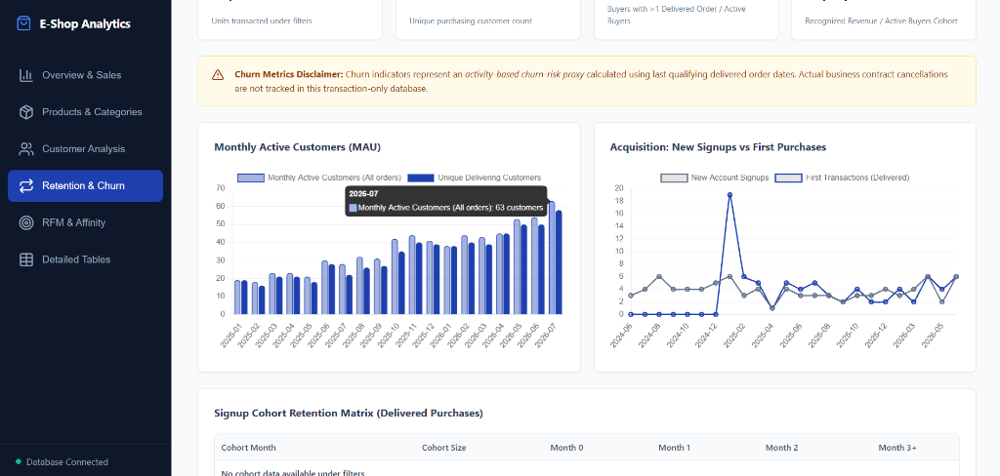
*Monthly Active Customers (MAU), New Signups vs First Purchase Trends, & Cohort Matrix.*

#### 5. RFM Segmentation & Market Basket Affinity
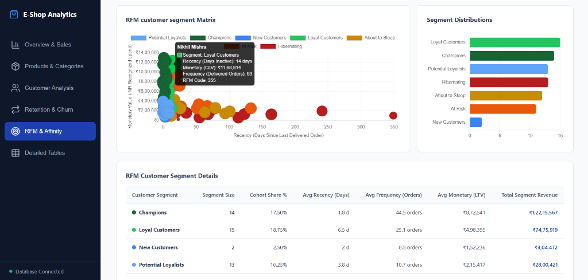
*RFM 2D Scatter Matrix (Monetary LTV vs Recency Inactivity) & Segment Share Table.*

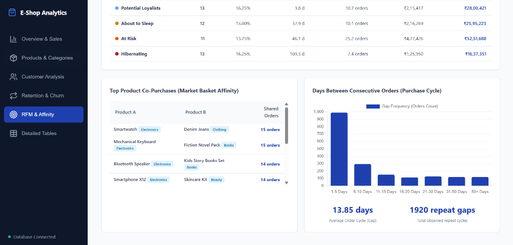
*Top Product Co-Purchases (Market Basket Pairs) and Purchase Cycle Interval Distribution (13.85 days average order cycle).*

#### 6. Detailed Master Data Tables
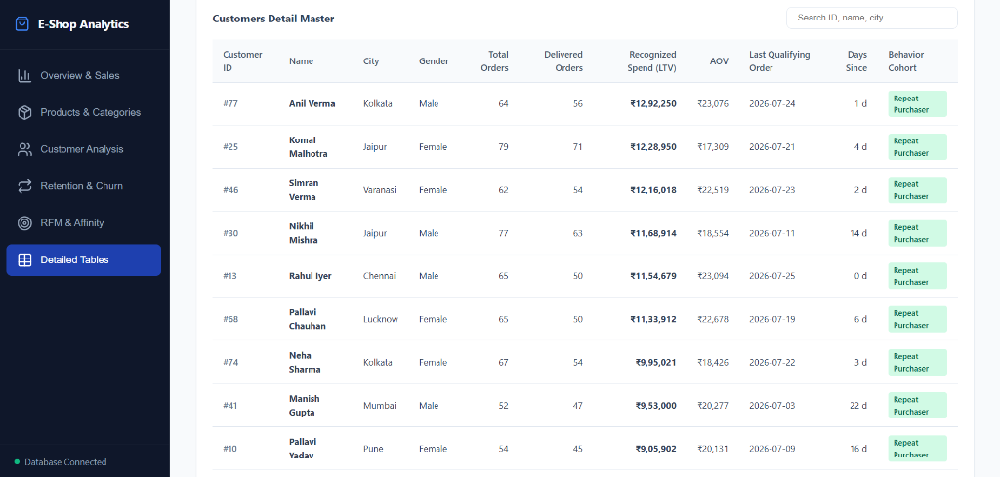
*Granular Customer Master Table with search, sorting, pagination, and behavioral cohort badges.*

---


## 🗃️ Database Schema & Data Model
The database is structured as a transaction-focused star schema containing four core tables:

```text
  customers (customer_id)
      │
      └───1:N───> orders (order_id)
                    │
                    └───1:N───> order_items (order_item_id)
                                  │
                                  └───N:1───> products (product_id)
```

- **`customers`** (90 rows): Customer registry containing name, city, gender, and signup date.
- **`products`** (38 rows): Catalog registry detailing product name, category, and catalog price.
- **`orders`** (2,000 rows): Transaction headers tracking order date, customer link, and order status.
- **`order_items`** (4,967 rows): Transaction lines tracking quantity and price per product in each order.

---

## 🔍 Data Quality & Schema Audit
Before writing analytical queries, we audited the raw dataset to identify logical and physical risks:
- **Duplicate Customer Names**: Found 5 names representing distinct customers (e.g., two *Aditya Vermas* with IDs 17 and 57). *Analytical fix: Grouping by `customer_id` is enforced in all SQL scripts to prevent profile leaks.*
- **Referential Integrity**: 100% passed. No orphan order headers or order line items exist.
- **Value Constraints**: Quantities and unit prices contain zero negative/zero values. Sales unit prices match catalog prices in 100% of cases.
- **Unconverted Accounts**: 10 out of 90 registered customers (11.11%) have never placed an order.
- **Order Status Distribution**: Out of 2,000 orders placed, 1,649 are `Delivered` (82.45%), 240 are `Cancelled` (12.00%), and 111 are `Pending` (5.55%).

---

## 📐 Business Metric & Assumption Register
To maintain consistency across all 52 queries, we defined key metrics:

1. **Recognized Revenue (Primary)**: Enforced as the sum of `quantity * unit_price` in delivered orders only (**32,280,641.00**). Cancelled orders (**5,213,749.00** or 12.7%) are excluded as they represent failed bookings.
2. **Centralized Anchor Date**: The latest order date in the dataset is **2026-07-25**. This date is derived dynamically in queries to set relative thresholds (90-day inactivity, 120-day churn risk), protecting scripts from becoming stale.
3. **Customer Churn Rate**: Calculated strictly on the active purchasing cohort ($N=80$) using a 90-day inactivity threshold. Our **churn rate is 10.00%** (8 cold buyers). Never-purchased customers are tracked separately under the **Never-Purchased Rate** (11.11%).
4. **CLV (Historical)**: Refers strictly to historical recognized spending per customer.
5. **No Profit/Margin calculations**: Since product costs (COGS) are missing, we exclude margin metrics, listing this as a data limitation.

---

## 💡 Key Analytical Insights
1. **Category Dominance**: Electronics is our dominant revenue category, contributing **63.43% (20.47M)** of total sales. The **Smartphone X12** alone generates **22.37% (7.22M)** of total company revenue.
2. **Geographical Strengths**: Mumbai leads in sales (**5.19M**), followed closely by Pune and Delhi in the top 3.
3. **Cohort Engagement**: The purchasing cohort has a **100% repeat purchase rate** (every buyer has purchased $\ge 2$ times). The average order cycle is **15.87 days**.
4. **Acquisition Funnel Risk**: The business scales primarily because of hyper-active existing customers placing frequent orders (95.15% of transactions are returning buyers), while customer acquisition is dangerously slow (~3 new signups per month).
5. **Affinity Pairings**: The top co-occurring basket pair is **Smartphone X12 & Skincare Kit** (13 orders together).

---

## 📂 Dual-Dialect Repository Structure
This repository supports both MySQL 8.x and PostgreSQL. Database views abstract dialect-specific date formatting and string handling, allowing the core query suites to run identically on both platforms:

- **`database/`**
  - [`schema_mysql.sql`](file:///d:/Data%20Analysis%20Projects/E-Commerce%20Data%20Analysis%20with%20SQL/database/schema_mysql.sql): MySQL database loader (includes database creation and initialization).
  - [`schema_postgresql.sql`](file:///d:/Data%20Analysis%20Projects/E-Commerce%20Data%20Analysis%20with%20SQL/database/schema_postgresql.sql): PostgreSQL-compliant schema loader.
- **`views/`**: Contains reporting database views:
  - [`views/mysql/`](file:///d:/Data%20Analysis%20Projects/E-Commerce%20Data%20Analysis%20with%20SQL/views/mysql/): MySQL-native views using `DATEDIFF` and `DATE_FORMAT`.
  - [`views/`](file:///d:/Data%20Analysis%20Projects/E-Commerce%20Data%20Analysis%20with%20SQL/views/): PostgreSQL views using standard interval date arithmetic.
- **`sql/`**: Grouped query files solving all 52 questions:
  - Standard PostgreSQL scripts (`01_` through `10_`) in the root.
  - [`mysql_dialect_overrides.sql`](file:///d:/Data%20Analysis%20Projects/E-Commerce%20Data%20Analysis%20with%20SQL/sql/mysql_dialect_overrides.sql): MySQL Workbench translations for queries using raw date math outside of views (Q9, Q13, Q26, Q34, Q37, Q51).
- **`validation/`**: Quality checking framework:
  - [`reconciliation_checks.sql`](file:///d:/Data%20Analysis%20Projects/E-Commerce%20Data%20Analysis%20with%20SQL/validation/reconciliation_checks.sql): Cross-layer reconciliation suite running 8 audits.
  - [`verify_results.py`](file:///d:/Data%20Analysis%20Projects/E-Commerce%20Data%20Analysis%20with%20SQL/validation/verify_results.py): Python automated test runner executing both MySQL and PostgreSQL validation sweeps.
